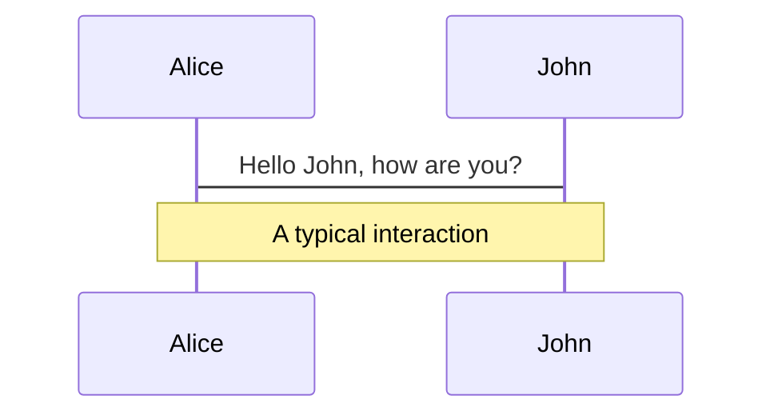
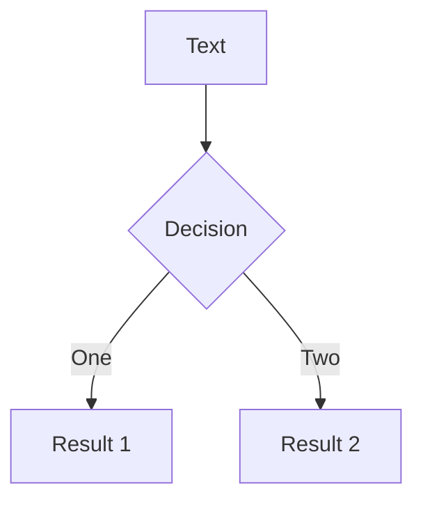

## 北京科技大学 学生学习与发展指导中心

# 每日一题

## 高等数学


---
layout: iframe-right
url: >-
  https://player.bilibili.com/player.html?aid=554160744&bvid=BV1qv4y1N75U&cid=724800374&page=1
---

# 第九章总复习


---

# Slide Title

Slide Subtitle

* Slide bullet text
  * Slide bullet text
  * Slide bullet text
* Slide bullet text
* Slide bullet text


---
layout: text-image
media: https://source.unsplash.com/collection/94734566/1920x1080
---

# Slide Title

Colons can be used to align columns.

| Tables        |      Are      |  Cool |
| ------------- | :-----------: | ----: |
| col 2 is      |   centered    |   $12 |
| col 3 is      | right-aligned | $1600 |
| zebra stripes |   are neat    |    $1 |


---
layout: new-section
---

# Section Title

njsancasnk


---
layout: statement
---

# Statement


---
layout: fact
---

# 100%

Fact information


---
layout: quote
---

# "Notable quote"

Attribution


---
layout: text-window
---

# Consoles

Use code snippets and get the highlighting directly into a nice looking window!

::window::

```ts
// main.ts
import { createApp } from 'vue';
import { createDynamicForms } from '@asigloo/vue-dynamic-forms';
const VueDynamicForms = createDynamicForms({
  // Global Options go here
});
export const app = createApp(App);
app.use(VueDynamicForms);
```


---
layout: image-left
image: https://source.unsplash.com/collection/94734566/1920x1080
---

# Code

```ts {all|2|1-6|all}
interface User {
  id: number
  firstName: string
  lastName: string
  role: string
}

function updateUser(id: number, update: Partial<User>) {
  const user = getUser(id)
  const newUser = {...user, ...update}
  saveUser(id, newUser)
}
```


---
layout: presenter
presenterImage: >-
  https://res.cloudinary.com/alvarosaburido/image/upload/v1622370075/as-portfolio/alvaro_saburido.jpg
---

# Alvaro Saburido Rodriguez

Senior Front-end Engineer at <fancy-link  href="https://bcn.porsche.digital/en/" favicon="https://www.google.com/s2/favicons?domain=porsche.com" >Porsche Digital</fancy-link>

* Dev Advocate
* I often write at <fancy-link href="https://dev.to/alvarosaburido">@alvarosaburido</fancy-link>
* Portfolio <fancy-link href="https://alvarosaburido.dev">alvarosaburido.dev</fancy-link>
* Say hi at <fancy-link href="https://twitter.com/alvarosabu">@alvarosabu</fancy-link>


---
layout: text-image
media: https://media.giphy.com/media/VkMV9TldsPd28/giphy.gif
caption: I am a penguin
---

# This is a peguin

Arepa ipsum dolor amet jalabola! aenean sit tequeños se prendio esta mierdaa menool ladilla chamito;? Nisl nojoda eu amet in? Nisl cuál es la guachafita ni lava ni presta la batea háblame cloro gravida sifrino macundal panita; Sed háblame cloro nunc empanada ac coroto Na webona vladimil parchita?

* Cacique panita sit Se prendio el peo labia gravida Praesent tequeño.
* Qué paso mi pana?! elit parchita molleja aguacate vergación, háblame mollejúo chamito est burda mauris morbi;


---
layout: text-image
reverse: true
media: https://media.giphy.com/media/VkMV9TldsPd28/giphy.gif
---

# This is a reverse peguin

Arepa ipsum dolor amet jalabola! aenean sit tequeños se prendio esta mierdaa menool ladilla chamito;? Nisl nojoda eu amet in? Nisl cuál es la guachafita ni lava ni presta la batea háblame cloro gravida sifrino macundal panita; Sed háblame cloro nunc empanada ac coroto Na webona vladimil parchita? Cacique ladilla sit Se prendio el peo labia gravida Praesent tequeño. Qué paso mi pana?! elit parchita molleja aguacate vergación, háblame mollejúo chamito est burda mauris morbi


---

# What is Slidev?

Slidev is a slides maker and presenter designed for developers `devs`, consist of the following features

* 📝 **Text-based** - focus on the content with Markdown, and then style them later
* 🎨 **Themable** - theme can be shared and used with npm packages
* 🧑‍💻 **Developer Friendly** - code highlighting, live coding with autocompletion
* 🤹 **Interactive** - embedding Vue components to enhance your expressions
* 🎥 **Recording** - built-in recording and camera view
* 📤 **Portable** - export into PDF, PNGs, or even a hostable SPA
* 🛠 **Hackable** - anything possible on a webpage

<br>
<br>

Read more about [Why Slidev?](https://sli.dev/guide/why)


---
layout: image-right
image: https://source.unsplash.com/collection/94734566/1920x1080
---

# sjajks

xsaxsxs


---
layout: dynamic-image
image: https://source.unsplash.com/collection/94734566/1920x1080
upperImage: https://source.unsplash.com/collection/94734566/1920x1080
equal: false
left: false
---

# Navigation

Hover on the bottom-left corner to see the navigation's controls panel

### Keyboard Shortcuts

| 快捷键                    | 释疑                        |
| ------------------------- | --------------------------- |
| `down`                    | next slide                  |
| `left`                    | previous animation or slide |
| `space` / `tab` / `right` | next animation or slide     |
| `up`                      | previous slide              |


---
layout: image-right
image: https://source.unsplash.com/collection/94734566/1920x1080
---

# Code

Use code snippets and get the highlighting directly![^1]
[^1]: [Learn More](https://sli.dev/guide/syntax.html#line-highlighting)

```ts {all|2|1-6|9|all}
interface User {
  id: number
  firstName: string
  lastName: string
  role: string
}

function updateUser(id: number, update: User) {
  const user = getUser(id)
  const newUser = {...user, ...update}  
  saveUser(id, newUser)
}
```


<arrow v-click="3" x1="400" y1="420" x2="210" y2="340" color="#564" width="3" arrowSize="1" />


<style>
.footnotes-sep {
  @apply mt-20 opacity-10;
}
.footnotes {
  @apply text-sm opacity-75;
}
.footnote-backref {
  display: none;
}
</style>


---
class: px-20
---

# Themes

Slidev comes with powerful theming support. Themes can provide styles, layouts, components, or even configurations for tools. Switching between themes by just **one edit** in your frontmatter:

<div grid="~ cols-2 gap-2" m="-t-2">

```yaml
---
theme: default
---
```

```yaml
---
theme: seriph
---
```


</div>

Read more about [How to use a theme](https://sli.dev/themes/use.html) and
check out the [Awesome Themes Gallery](https://sli.dev/themes/gallery.html).


---
preload: false
---

# Animations

Animations are powered by [@vueuse/motion](https://motion.vueuse.org/).

```html
<div
  v-motion
  :initial="{ x: -80 }"
  :enter="{ x: 0 }">
  Slidev
</div>
```

<div class="w-60 relative mt-6">
  <div class="relative w-40 h-40">
    
    
    
  </div>

  <div
    class="text-5xl absolute top-14 left-40 text-[#2B90B6] -z-1"
    v-motion
    :initial="{ x: -80, opacity: 0}"
    :enter="{ x: 0, opacity: 1, transition: { delay: 2000, duration: 1000 } }">
    Slidev
  </div>
</div>

<!-- vue script setup scripts can be directly used in markdown, and will only affects current page -->
<script setup lang="ts">
const final = {
  x: 0,
  y: 0,
  rotate: 0,
  scale: 1,
  transition: {
    type: 'spring',
    damping: 10,
    stiffness: 20,
    mass: 2
  }
}
</script>

<div
  v-motion
  :initial="{ x:35, y: 40, opacity: 0}"
  :enter="{ y: 0, opacity: 1, transition: { delay: 3500 } }">

[Learn More](https://sli.dev/guide/animations.html#motion)

</div>


---

# LaTeX

LaTeX is supported out-of-box powered by [KaTeX](https://katex.org/).

Inline $\sqrt{3x-1}+(1+x)^2 \ge 0$ 是
$\abs{a}$ $\bb$ 是
$\int x\dif x$ 是
$\Im \Re \sgn \upi \grad$ $\upe$ 是
$\uppartial$

Block
$$
\begin{array}{c}

\nabla \times \vec{\mathbf{B}} -\, \frac1c\, \frac{\partial\vec{\mathbf{E}}}{\partial t} &
= \frac{4\pi}{c}\vec{\mathbf{j}}    \nabla \cdot \vec{\mathbf{E}} & = 4 \pi \rho \\

\nabla \times \vec{\mathbf{E}}\, +\, \frac1c\, \frac{\partial\vec{\mathbf{B}}}{\partial t} & = \vec{\mathbf{0}} \\

\nabla \cdot \vec{\mathbf{B}} & = 0

\end{array}
$$

$$
\begin{align}
\begin{split}
\frac{D \bm{v}}{D t}=&-\frac{1}{\rho} \grad p+\frac{\mu}{\rho} \Delta \bm{v}+\frac{\lambda+\mu}{\rho} \grad \Theta+\frac{\Theta}{\rho} \grad(\lambda+\mu) \\
&+\frac{1}{\rho} \grad(\bm{v} \cdot \grad \mu)+\frac{1}{\rho} \rot(\bm{v} \times \grad \mu)-\frac{1}{\rho} \bm{v} \Delta \mu+\bm{g}
\end{split}&
\end{align}
$$

[Learn more](https://sli.dev/guide/syntax#latex)


---

# Diagrams

You can create diagrams / graphs from textual descriptions, directly in your Markdown.

<div class="grid grid-cols-2 gap-10">



</div>
